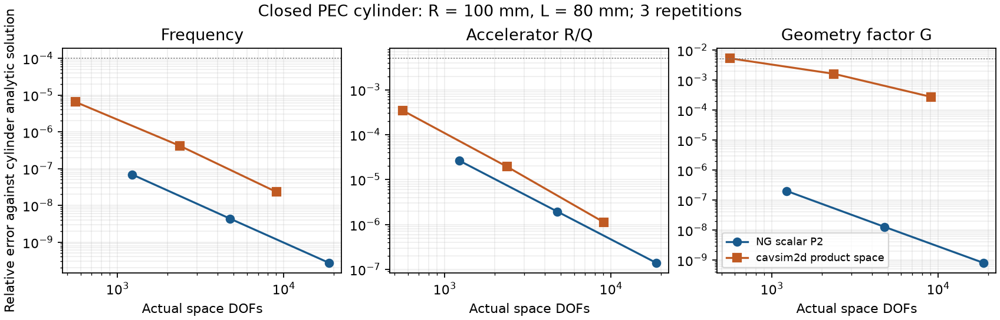
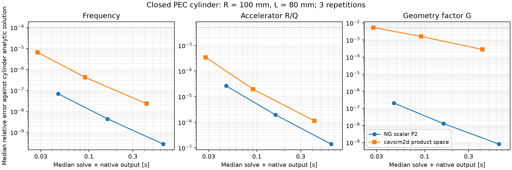

# A01 / P0-04: cavsim2dとの役割比較と採用判断

2026-09-14。A01の仕様・比較実装・検証を受入。
**製品の計算経路は自作NGを維持し、cavsim2dは必要時の独立参照候補とする。**
この判断は二つの閉PEC合成空洞の比較に基づく。cavsim2d全機能の品質判定、
全形状での優劣、旧SUPERFISH互換や全計画の受入ではない。

## 要件と証拠

| A01の要件 | 今回の証拠 | 判定 |
|---|---|---|
| 比較候補版・用途・依存・条件 | 0.1.0、commit `48741ff46ca44463281a5ab5945328615881b502`、79個の選択Python/metadata SHA、隔離環境の全版を記録 | 受入 |
| 役割・精度/DOF/時間のADR | ADR-018、両側3水準×2形状×3回、36実FEM。実自由度・規約・全出力を照合 | 受入 |
| 採用は測定後に判断 | 性能表、円筒解析誤差、依存と公開入力の問題を根拠に製品組込みを見送る | 受入 |
| 参照不能/失敗を未実行と記録 | 初回import失敗、公開円筒の境界不一致、比較器の型/API修正を保存 | 受入 |
| NGを参照で代替しない | NG本体・既定依存・FEM・許容差は無変更。参照は別環境の比較スクリプトのみ | 受入 |

機械可読の入力・3回の全主要数値・版・SHAは
[`benchmarks/cavsim2d/a01-20260914.json`](../benchmarks/cavsim2d/a01-20260914.json)。
詳細な生出力・失敗ログ・出典取得metadataは`out/a01-backend-20260914/`に保持する。
最終専用実行は`final-corrected/comparison.json`、10.436秒、全36 solveでPASS。

## 対象と出典の境界

固定版の[README](https://github.com/Dark-Elektron/cavsim2d/blob/48741ff46ca44463281a5ab5945328615881b502/README.md)、
[依存宣言](https://github.com/Dark-Elektron/cavsim2d/blob/48741ff46ca44463281a5ab5945328615881b502/pyproject.toml)、
[MITライセンス](https://github.com/Dark-Elektron/cavsim2d/blob/48741ff46ca44463281a5ab5945328615881b502/LICENSE)を確認した。
公開APIと現代的なNGSolve Python実装の入出力・規約を調べ、未変更のコードを`/tmp`で実行した。
ライブラリの実装をNGの製品ソースへコピーしていない。
同梱ABCI/TopDrawer実行形式、旧SUPERFISH/POISSONソース・バイナリは取得していない。
一括clone/wheel取得は避け、Pythonファイルと明示metadataだけを固定commitから選択取得した。
無条件importに必要なABCIの**現代的Pythonインターフェース**1ファイルは含むが、
ABCI本体やwakefieldは実行していない。全第三者Pythonコピーには元MIT LICENSEを保持する。

NGSolve/Netgenは6.2.2606（LGPL-2.1-only）、Gmshは4.15.2（GPL v2以降＋添付例外）、
netgen-occtは7.8.1（添付LGPL 2.1）、ngsolve-openblasは0.3.33（BSD-3-Clause）。
NumPy 2.5.2/SciPy 1.18.1は製品環境と同版。Python 3.12.3/Linux。
宣言されたcore依存だけではIPythonの無条件importで失敗し、jupyter extraの
IPython 9.17.1/ipywidgets 8.1.9を追加するとimportできた。この隔離環境は約1.1 GiB。
これは依存候補の測定であり、バイナリ全体の再配布許諾を認定したものではない。
製品の`pyproject.toml`・通常仮想環境は変更していない。

## 同じ物理問題に合わせる

対象は真空、閉PEC、軸接続、基本TM、beta=1、peak phasor。
円筒はR=0.1 m/L=0.08 m、円錐台は入口R=0.08 m/出口R=0.10 m/L=0.12 m。
いずれも合成形状。円錐台の端接合角を滑らかな表面ピーク検証へ読み替えない。

公開`Pillbox(1,[80,100,20,0,0],beampipe='none')`で`set_boundary_conditions(11)`と
`boundary_conditions='ee'`を指定したが、保存メッシュにはPMC長0.04 mが残った。
AXI=0.08 m、PEC=0.24 mであり、要求した閉円筒のPEC=0.28 mに一致しない。
f=1161.93958 MHzという結果を閉PEC円筒との一致/性能比較に流用しない。
これは固定版の当該公開経路の観測である。

そこで比較用`Cavity`派生クラスを作り、公開`Profile` APIで四辺とPEC/AXIを明示する。
数値ソルバー・求積・RF後処理は変更しない。入力には両端半径と長さをSIで保存し、
`a01-profile.json`と専用モデル種別を保持する。別形状のPillboxデッキを残さない。
この参照モデルを標準`Study.load`対応の製品モデルとは主張しない。

両側の実メッシュから辺長、子午面面積`L(R0+R1)/2`、
回転体積`pi L(R0²+R0 R1+R1²)/3`を独立に照合する。
未知の境界タグやPMCがあれば比較を拒否する。

NGは既存のスカラーP2 `u=Hphi/r`、nr=12/24/48、nz=2nr。
cavsim2dは独立Netgen/OCCメッシュのh=20/10/5 mm、HCurl(p=2)×H1(p+1)のE空間。
m=0でもTM/TEを含む複合空間を解くため、基本場のTE電気エネルギー比を検査する。
最大7.85e-27。NGへ候補のメッシュ/行列/場を入力していない。
NumPy/SciPy、物理定数の規約を共有するので完全に独立したスタックではない。

候補の`R/Q`は実数値で`|V|²/(omega U)`と照合し、NGのaccelerator定義へ対応させる。
circuit定義は別名の半値。外部コメントの呼称だけで規約を推定しない。
候補の保存E/Hを独立積分してUe/Uhを確認し、総U=1 Jへ一括正規化する。
最大エネルギー不一致1.33e-10、報告Uとの差2.69e-10。
12内部点のE/Hは座標zをL/2だけ移し、H全体から選ぶ単一符号だけを合わせる。
点ごとの振幅補正・周波数補正・解析場への置換は行わない。

## 精度・自由度・費用

最終水準同士の相対差の3回中最大:

| 量 | 円筒 | 円錐台 | 許容値 |
|---|---:|---:|---:|
| f | 2.283e-8 | 2.567e-8 | 1e-4 |
| accelerator R/Q | 1.021e-6 | 2.050e-6 | 0.005 |
| G | 2.750e-4 | 5.178e-4 | 0.005 |
| 内部E相対L2 | 1.848e-5 | 2.141e-5 | 0.005 |
| 内部Hphi相対L2 | 2.671e-4 | 2.190e-4 | 0.005 |

最終2水準の差も両側で別判定し、最大G変化は候補の円錐台0.002534。
同じ誤りで一致する場合を検出するため、円筒は独立解析五量も判定する。
候補の解析相対差はf=2.310e-8、RQ=1.161e-6、G=2.750e-4、E比=4.214e-6、B比=3.507e-4。
NGは同じ順に2.729e-10、1.399e-7、8.015e-10、1.604e-8、1.849e-7。
ピーク比の許容値は0.01。双方の解析f/RQ/Gも上表の元許容値を維持する。

| 形状/水準 | NG実DOF | 候補実DOF | NG時間中央値[s] | 候補時間中央値[s] |
|---|---:|---:|---:|---:|
| 円筒/粗 | 1225 | 559 | 0.04634 | 0.02774 |
| 円筒/中 | 4753 | 2365 | 0.15957 | 0.09109 |
| 円筒/細 | 18721 | 9049 | 0.64128 | 0.42343 |
| 円錐台/粗 | 1225 | 700 | 0.04554 | 0.03505 |
| 円錐台/中 | 4753 | 3031 | 0.15444 | 0.11821 |
| 円錐台/細 | 18721 | 12733 | 0.63853 | 0.66198 |

時間は各側のメッシュ/solve/RF/通常native出力を含み、importと独立の読込/場検査を除く。
同一プロセス内で実行順を交互にした3観測の中央値。数値validatorの並行実行はない。
NGは1モード、候補は1モード要求でもpaddingを含む3モードを計算・保存した。
出力内容や自由度の意味も異なるため、同一演算量・等精度の速度比や一般性能保証とはしない。
候補の表示DOFは最細円筒5628/円錐台7926だったが、実保存空間は9049/12733。
表示値はHCurl部分のみであり、表ではH1成分も含む実係数数を使用した。





## 再現・失敗と検証範囲

隔離環境へ、固定commitの`cavsim2d/`以下の`.py`全74ファイルと
`LICENSE`/`README.md`/`pyproject.toml`、型/API確認用の`tests/test_cavity_types.py`と
`tests/test_eigenmode.py`だけを個別取得する。全79パスとSHAは上記benchmark JSONに保持する。
`raw.githubusercontent.com/Dark-Elektron/cavsim2d/<commit>/<path>`から取得してSHA256を照合し、
元ツリーを`source_root`、全79項目を`files`、固定版を`commit`とするmanifest JSONを作る。
ABI/依存版は同JSONのenvironment.packagesを参照する。導入にだけネットワークを使う。

```
python3 -m venv /tmp/a01-reference-new
# 上述した選択sourceを/tmp/a01-source-newへ準備してSHAを照合後:
/tmp/a01-reference-new/bin/python -m pip install -e '/tmp/a01-source-new[jupyter]' \
  numpy==2.5.2 scipy==1.18.1 ngsolve==6.2.2606 gmsh==4.15.2
OPENBLAS_NUM_THREADS=1 OMP_NUM_THREADS=1 MPLBACKEND=Agg MPLCONFIGDIR=/tmp/a01-mpl-new \
  /tmp/a01-reference-new/bin/python scripts/compare_cavsim2d.py \
  --source-manifest /tmp/a01-source-manifest.json --out out/a01-new --repetitions 3
```

既存出力は上書きしない。実行時はPythonの接続/DNS監査でもネットワーク要求を拒否する。
実import先と選択sourceのSHA一致も別プローブで確認し、第三者コードは無変更だった。
比較中の1047ソース系SHAは最終実装と一致し、全実行中不変。

新unittest4件0.026秒、既存独立比較の判定5件、隔離環境の既存物理2件0.113秒が合格。
既存判定5件は初回の10件実行で確認し、当時の任意NGSolve物理2skipは後者で補った。
合計11件の分割証拠であり、単一全件実行ではない。全suite/seed/ブラウザー/Hosted CI/新Wine比較は未実行。
FEM本体を変更せず、比較器と直接の物理・判定だけを検証した。

初回import失敗のほか、比較器のHphiが長さ1 tupleである点、直線Caseへの曲線専用求積指定、
FieldSamplerの生成API、基底Cavityがn_cellsを保持しない点を各実行で検出・修正した。
`initial/verified/compared/final`の失敗出力を残す。`measured`は先行1回の数値PASSだが、
未使用の継承Pillbox入力記録が残るため最終証拠とせず、専用モデルへ変更した36 solveを採用した。

## 採用判断

候補の現代的なFEM経路は、この二つの明示Profileと規約で独立参照に利用できる。
一方、今回の円筒では自作NGの解析誤差が小さく、一般的な速度優位は得られていない。
公開円筒の端条件・表示DOF・任意依存の問題もあるため、NGの製品solve/strict入力/保存を置換する理由はない。
今後NG外の機能を参照したくなった時は、当該版・物理・規約を別に検証する。
A01/P0-04を受入とし、他の親課題の未確認事項をこの比較で閉じない。
