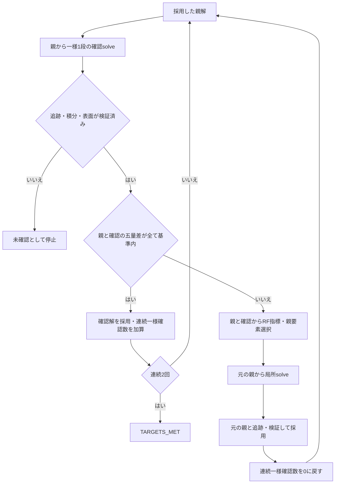

# RF選択を使う自動適応の状態遷移と受入条件

2026-09-09。決定記録と実装状況。現在は[版5のAPI/CLI/JobManager](CURVED_RF_ADAPTIVE_REFINEMENT.md)と[GUI](GUI_RF_ADAPTIVE.md)の基本経路を部分受入した。
[既存版4](CURVED_ADAPTIVE_REFINEMENT.md)と[RF親要素選択](CURVED_RF_GOAL_INDICATOR.md)を照合した。
版4は常に直前の採用解から履歴を延長する。RF選択では、一様確認から得た指標を使って
元の親へ戻り局所細分するため、確認解と局所解は同じ親から分岐する。
確認解を直前の親と誤認すると、要素番号・モード追跡・保存再検証が成立しない。

## 決定した構成

適応request schema_version 5を追加した。版4の文書・停止・再開意味は保持する。
版5はRF選択を明示した経路とし、暗黙に従来残差へフォールバックしない。
初期版はRF指標の受理範囲である直接native二次空間・滑らかなPECまたは単一対称半領域。
既存RF/表面/積分/品質/追跡の条件を再利用し、許容差を緩めない。

実solveは一本道の`level_runs`として解釈せず、実行順のイベントとして保存する。
各イベントの親と用途を導出して検証する。役割は初期解、一様確認、RF局所細分。
採用解列はイベント番号を参照し、同じnative出力を複製しない。
確認解のnative出力・計算費用・指標は、不採用でも保持する。

以下の図は既定の`rf_goal`経路。[任意の表面細分方針](CURVED_RF_SURFACE_POLICY.md)では、
RF三量が合格し表面だけ未達の確認を次の親に採用し、合格数0から一様細分を続ける。
既存requestの未指定動作と五量2回連続合格の停止条件は維持する。

五量は周波数、加速器規約R/Q、G、連続離散Epk/Eacc区間、Bpk/Eacc区間。
TARGETS_METは最終採用列における連続2回の一様細分で、両区間の五量差が全て基準内の場合のみ。
RF指標の大きさ・ゼロや代数残差からTARGETS_METへ遷移しない。
一様確認が基準未達なら、その確認解を親にして同じ選択番号を使ってはいけない。
選択番号もモードIDも元の親に属する。局所解の追跡は元の親から行う。

## 予算・中断・再検証

- `max_levels`は版5では全実solveイベント数を数える。初期・一様確認・局所solveを全て含める。
  版4の採用水準数とは意味が異なるため、版5のヘルプと文書で明示する。
- 一様確認にもtriangle/feature/品質予算を事前適用する。確認を予算外の無料計算にしない。
- `max_new_levels`も実solve数を数え、確認直後で中断できる。再開では保存済み確認を再solveしない。
- checkpointは全イベントrunのsnapshotと実装hashを保持する。親番号・役割・採用列・指標は
  native Case/mesh/場と元requestから再導出する。保存された判定を信頼しない。
- 指標評価用の検証済み移送は実行中だけ共有し、永続checkpointから読み込んで信頼しない。
- 初回checkpointも保存場を再読込して判定を組み立てる。native読込は周波数からλを再構成するため、
  solve直後のλで算出した指標とは丸めが異なり得る。初回とreplayの入力規約を一致させる。
- 不正な親参照、入替え、確認出力改変、ID不明、ゼロ指標、上限到達を成功に読み替えない。
- 中途失敗では直前checkpointを保持し、失敗した未採用runを記録する。

## 実装順と受入証拠

| 項目 | 必要な実装 | 受入を証明する検査 |
|---|---|---|
| RFA-1 | strict版5 request・イベントplanner・既存dispatch | 版4文書完全一致、版5の未知指定/予算/非対応幾何拒否 |
| RFA-2 | 初期→確認→元親から局所の実行 | 実native親子Case/幾何一致、親要素番号、元親からの個別追跡、Ritz |
| RFA-3 | 確認採用と2回連続五量停止 | 1回だけでは停止しない、E/B片方だけ未達でも停止しない、積分未達拒否 |
| RFA-4 | 中断・再開・canonical replay | 確認直後/局所直後の中断、保存場読込時のeigsh禁止、改変と誤親拒否 |
| RFA-5 | CLI/JobManager/GUI・保存表示 | 実ジョブ、取消し/再開、親/確認/局所の表示・採用状態・全solve数/費用 |
| RFA-6 | 反復・独立精度と費用 | 球形の解析五量、非球形の追加一様対照、尺度則、全solve/指標/保存費用を含む比較 |

RFA-1〜4は版5の入力/イベント実行/五量停止/中断再開・改変拒否と版4文書完全一致を確認した。
RFA-5はCLI・JobManagerに加え、GUI入力・親/採用表示・場選択・保存・取消し後の実再開を確認した。
[祖先ジョブに記録された時間の表示](GUI_RF_ADAPTIVE_COST.md)を追加した。再開前・中止ジョブを重複なく合算し、欠測は不明と表示する。利用者操作全体の時間計測とは区別する。
RFA-6は電気対称半球1尺度の独立解析五量に加え、[明示方針の非球形両尺度](CURVED_RF_SURFACE_POLICY.md)で元の条件/予算・追加対照五量・Maxwell・体積・全execute費用を確認した。従来R/Q単独の一般収束や一般効率は未受入。
時間metadataを数値の再検証と区別し、未記録区間を0秒の完了費用として扱わない。完了→再開、中止→再開、重複排除、外部出力の不明表示を実ジョブとChromeで検査した。
詳細は[実装と検証](CURVED_RF_ADAPTIVE_REFINEMENT.md)。
一様確認の費用と再構築の重複を含めて測定し、一般精度/効率の親N04を先に受入しない。
