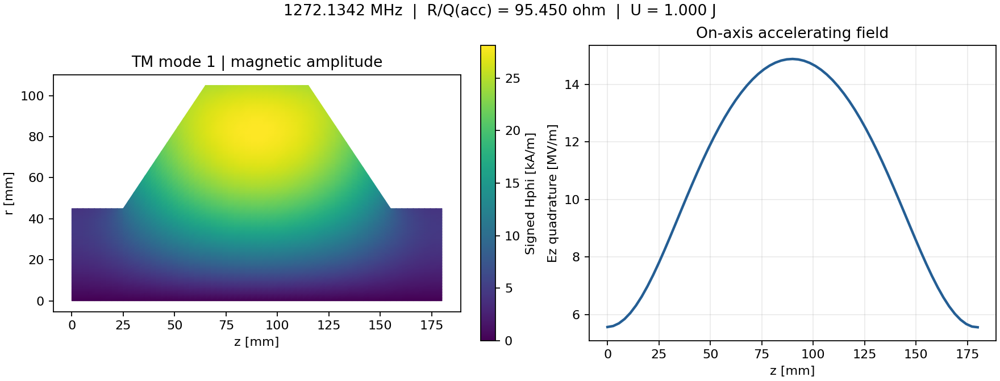

# 初期検証報告 — 2026-09-05

総合結果: **PASS**。unittest 23件と収束ゲートを実行した。
これは実装のverificationであり、実機やlegacy SUPERFISHによるvalidation完了を意味しない。

環境: Python 3.12.13 / NumPy 2.3.5 / SciPy 1.17.0。
詳しいコマンド、所要時間、source hashは `benchmarks/validation/validation.json`。
テストごとの結果は `benchmarks/validation/tests.log`。

## Pillbox TM010 の周波数収束

半径0.1 m、長さ0.2 m、真空、全PEC、β=1、σ=5.8e7 S/m。
解析周波数: **1147.425278352 MHz**。

| nr=nz | 節点数 | 周波数 MHz | 相対誤差 | R/Q 相対誤差 |
|---:|---:|---:|---:|---:|
| 8 | 81 | 1147.498644588 | 6.394e-05 | 3.086e-02 |
| 16 | 289 | 1147.444554942 | 1.680e-05 | 9.576e-03 |
| 32 | 1089 | 1147.430164085 | 4.258e-06 | 2.866e-03 |
| 64 | 4225 | 1147.426504135 | 1.068e-06 | 8.364e-04 |

周波数は約2次で改善するが、軸上Ezを用いるR/Qはより遅い。周波数誤差をRF量全体の誤差と読み替えない。

## 最細メッシュのRF量

| 量 | 解析値 | FEM値 | 相対誤差 |
|---|---:|---:|---:|
| frequency_hz | 1.14742528e+09 | 1.1474265e+09 | 1.068e-06 |
| q0 | 34171.5606 | 34171.5267 | 9.921e-07 |
| geometry_factor_ohm | 301.990229 | 301.99009 | 4.580e-07 |
| r_over_q_accelerator_ohm | 57.7715229 | 57.8198429 | 8.364e-04 |
| transit_time_factor_abs | 0.279395315 | 0.27939469 | 2.237e-06 |
| epk_over_eacc_estimate | 3.57915808 | 3.58031242 | 3.225e-04 |
| bpk_over_eacc_estimate_mt_per_mv_per_m | 6.94676456 | 6.94398975 | 3.994e-04 |

ピーク比の単位と推定範囲はPHYSICS.md参照。長いpillboxのためTTFが約0.279で、R/Qは短い空洞の値とは異なる。

## 高次モード

nr=40、nz=48。同じ解析スペクトルの先頭6個を比較する。
これはm=0 TMの6個であり、TEやm>0を含めた全Maxwellスペクトルではない。

| 解析ラベル | 解析 MHz | FEM MHz | 相対誤差 |
|---|---:|---:|---:|
| TM010 | 1147.425278 | 1147.428412 | 2.731e-06 |
| TM011 | 1370.513318 | 1370.732662 | 1.600e-04 |
| TM012 | 1887.716270 | 1888.983454 | 6.713e-04 |
| TM013 | 2524.298447 | 2528.210998 | 1.550e-03 |
| TM020 | 2633.819797 | 2635.183642 | 5.178e-04 |
| TM021 | 2738.380673 | 2740.795566 | 8.819e-04 |

高次モードの合格条件は0.3%であり、基本モードの1e-4条件を全モードが満たしたという意味ではない。

## 非円筒形状の自己収束

`examples/shaped_cell.json` は合成した首付き空洞。両端は閉じたPEC端板で、実機のビームポートではない。

| nr | nz目安 | 節点 | f MHz | R/Q(acc) Ω | Q0 | Epk/Eacc 推定 |
|---:|---:|---:|---:|---:|---:|---:|
| 16 | 32 | 612 | 1272.891368 | 95.724702 | 31847.147 | 2.021129 |
| 32 | 64 | 2211 | 1272.134242 | 95.449950 | 31846.477 | 2.157923 |
| 64 | 128 | 8515 | 1271.864181 | 95.395567 | 31844.899 | 2.587578 |

**周波数・積分量が落ち着いても、角部のEpkは増加している。** この表をピーク電場の収束証明に使ってはいけない。
実用設計では丸め半径を指定した滑らかな形状と高次メッシュで検証する必要がある。
外部参照のないため、これらの絶対値の精度は確定していない。



## 他の検査

- Bessel場との重み付きL2比較で、周波数だけを再現する誤実装を検出。
- 質量内積のモード直交性、固有値残差、電気/磁気エネルギーを確認。
- 任意形状の一様拡大でf∝1/s、R/Q一定、常伝導Q∝sqrt(s)を確認。
- Uを9倍、σを4倍とした場合の場振幅、壁損失、Qのスケーリングを確認。
- 軸上区分線形場の通過位相積分を独立した数値積分と比較。
- 未対応入力・重複キー・既存出力への上書きを拒否することを確認。

## 未実施

SUPERFISH/CST/NGSolve/GetDP/Palaceとのクロスチェック、実測比較、一般3D/TE、
真の曲面メッシュ、高次要素、MPI/GPU、Linux以外の実行、Hosted CI、ParaViewの対話操作は未実施。
Matplotlibによる保存場の描画は生成し、見切れや軸の取り違えがないことを目視確認した。

## 再実行

```bash
OPENBLAS_NUM_THREADS=1 python scripts/validate.py --out out/validation-new
python scripts/plot_results.py out/validation-new/shaped_cell --out out/validation-new/shaped_cell.png
python scripts/report_validation.py out/validation-new --out out/validation-report.md
```

新しい結果は納品ベースラインと比較し、精度を改善した場合も旧エビデンスを説明なく差し替えない。
