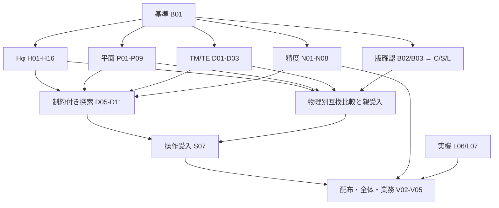

# 未完課題のコミット単位開発計画

H16-d/親H16受入（2026-09-22）：[材料調整・保存・GUI全条件監査](../MATERIAL_HPHI_TUNING_ACCEPTANCE.md)。最後の実Chromeは調整回復/最終細分4、中止/再開5、新サーバー軸RF再生2、不正物理拒否5項目が分割PASS。全native/Project取込一致、回復元24ファイル・全385実装hash不変、外部要求0、全handle終端。既存数値ログと実装差分を照合し、材料核の無変更を確認。次は依存が満たされたB02の対象版・入力資料調査。H17はB03を待つ。原90カードと全goalは継続。

H16-c受入（2026-09-22）：[所有保存・履歴・CLI/worker条件別監査](../MATERIAL_HPHI_OPERATION_ACCEPTANCE.md)。最後の実CLI回復検索→worker最終細分・元移動/管理器再起動と、真空軸/材料/穴ProjectのRF・再importを新2件601.458秒PASSで確認。解析TEM、元18ファイルのbyteコピー、全24ファイル不変、両R/Q/N/A・非真空区間/未対応損失拒否まで成立。全handle終端。次はH16-dのGUI操作と親H16監査。原90カードと全goalは継続。

2026-09-16 JST。作業者への引渡し用。基準は `6484e309785b218d4e950efb579b3ad8c38c327e`（平面調整GUI接続後）。

**対象は未受入の22親課題全てと、受入済みC02の追加互換部分集合。90枚の作業カードを9工程に分けた。**
仕様・実装・検証・受入監査を区別し、各カードに先行条件、既存の入口、変更内容、受入条件、検査候補、コミット件名案を記載する。

対象版の仕様、付属ツール、実機資料が未確認の部分には調査カードと条件付き展開手順を設けた。
そのため90枚は確定した最終コミット数ではない。仕様確定で追加が生じる箇所と、追加を誰がどう具体化するかも本計画の対象とする。
現在確認できない仕様の実装方式を確定済みとは扱わない。各カードの検証は今後の作業であり、本計画作成時には実行していない。

2026-09-21：実装時の分割規則に従いH09-a〜dの4子カードを追加した。原計画90カードは維持し、現在のTSVは子カードを含む94行。H09親は全子工程受入まで未完了。

2026-09-21追記：H09は全子工程を受入済み。H10-a〜cの3子カードを追加し、TSVは97行。H10-a〜cと親H10は[検索/最終細分への回復接続と条件別監査](../HPHI_TUNING_IDENTITY_RECOVERY.md)まで受入済み。次はH11。全計画は未完了。

2026-09-21追記：H11受入済み。H12を元場比較a/三水準診断bに分割し、TSVは99行（原計画90カードを維持）。[H12-a](../CURVED_HPHI_FIELDS.md)と[H12-b/親H12の監査](../CURVED_HPHI_CONVERGENCE.md)を受入済み、次はH13。全goalは未完了。

2026-09-21追記：H13を細分a/追跡核b/調整回復c/所有CLI-worker d/実GUI監査eに分割し、TSVは104行（原計画90カードを維持）。[H13-a](../CURVED_HPHI_REFINEMENT.md)は受入済み、次はH13-b。親H13は全子工程の受入まで未完了。

2026-09-22追記：H13-a〜c受入済み。H13-dの[所有調整API](../CURVED_HPHI_TUNING_SAVED.md)第一段階を実装・検証。独立追跡履歴とCLI/worker、中止/管理器再起動、H13-e GUI監査は残る。H13-d/親H13/全goalは未完了。

2026-09-22追記：H13-dの[全元native所有・CLI/worker・回復操作](../CURVED_HPHI_TUNING_RECOVERY_SAVED.md)を受入。次はH13-e実GUI/親監査。H08依存のH14仕様も待機中に[固定材料界面比較契約](../MATERIAL_HPHI_TRACKING.md)として受入済み。原計画90カードと全goalを維持し、親H13/材料実装H15以降は未完了。

2026-09-22追記：H13-eの[曲線調整GUI第一段階](../CURVED_HPHI_GUI.md)を接続。API/worker分割検査とChrome5項目を確認。実中止/サーバー再起動後表示、曲線追跡/履歴/回復の実GUIと親監査は残り、H13-e/親H13/全goalは未完了。

2026-09-22追記：H15を材料領域/界面a・物理重みの場/射影b・有限スペクトル/追跡監査cに分割。元90カードを維持し、TSVは107行。全子カードはPLANNED、H15/H16は未実装。H13-eのHTTP修正後の長時間操作検査中に、srcを変更せず次工程の依存と独立検査を具体化した。

2026-09-22追記：H13-eと親H13を[全条件監査](../CURVED_HPHI_ACCEPTANCE.md)まで受入。大きいcheckpointのHTTP不備を実Chromeで再現・修正し、穴付き中止/再開/新サーバー元場復元、調整/履歴の明示回復を分割検証。全handle終端。次はH15-a、全goalは未完了。

H16-b受入（2026-09-22）：[材料実調整・明示ID回復](../MATERIAL_HPHI_TUNING.md)。二層uniform/異率伸長の独立解析目標、実最終細分、非真空一様材料の実TEM回復/真縮退拒否、初回guardと別粗細gateを確認。新8件は分割PASS、全handle終端。粗いn=4の区間重なりによる未確認を保持し、n=6は190.411秒PASS。次はH16-cの所有保存/履歴/CLI-worker。親H16/全goalは継続。

H16-a受入（2026-09-22）：[材料候補・最終細分・比較空間](../MATERIAL_HPHI_TUNE_TRIALS.md)を接続。二段材料K/M移送、検索→実最終細分、穴付き軸の非一様変形/全加速座標、実E/H個別IDを検証。新4件＋関連6件は分割PASS、全handle終端。次はH16-bの実調整runnerと明示ID回復。親H16/全goalは継続。

H16-a進行中（2026-09-22）：[材料領域を保つ直線細分](../MATERIAL_HPHI_REFINEMENT.md)を実装。領域体積/全界面、P1/P2材料K/M移送、多項式/定数、予算を検査。次は固定材料形状則と試行比較。H16をa〜dへ分割し、原90カードを維持、TSVは111行。親H16/全goalは未完了。

H15-c/親H15受入（2026-09-22）：[全条件監査](../MATERIAL_HPHI_ACCEPTANCE.md)。独立再メッシュ/非一様正逆、P1/P2真空追跡極限、実材料順位交換/縮退、E/H/B尺度・片側界面を確認。新5件＋関連1件は分割PASS、専用validator32例96モードPASS、全handle終端。次はH16の材料調整/保存/CLI-worker/GUI。原計画と全goalは継続。

H15-b受入（2026-09-22）：[材料元E/H比較](../MATERIAL_HPHI_FIELDS.md)と[mu_r質量射影](../MATERIAL_HPHI_PROJECTION.md)を実装。独立積分/材料別質量/射影保存と損失/正逆写像/真空極限/元RF不変を検証。射影新6件＋関連場5件は分割証拠でPASS、全handle終端。次はH15-cの材料有限スペクトルとID追跡。親H15/全goalは未完了。

2026-09-22追記：H15-aの[固定材料領域/全界面比較](../MATERIAL_HPHI_COMPARISON.md)を受入。独立積分と全片側セル対応、微小界面ずれ拒否を検査。次はH15-b、親H15/全goalは継続。

## 文書構成

| 文書 | カード | 内容 |
|---|---|---|
| [01 基準と互換仕様](01-baseline.md) | B01〜B04 | 現行要件・証拠・対象版・必須集合 |
| [B01 残要件と証拠の対応台帳](B01-ledger.md) | K01〜K32・親33 | 受入軸の最新文書対応、担当カード、証拠の現存/欠落（`01-baseline.md#b01`の成果物） |
| [02 Hφ](02-hphi.md) | H01〜H18 | 形状比較、材料/曲線、ID回復、調整、保存/worker/GUI |
| [03 平面RF](03-planar.md) | P01〜P10 | アフィン/非線形形状、ID回復、曲線P2、調整 |
| [04 設計操作](04-design.md) | D01〜D11と6分割カード | TM/TE一般形状調整、物理別制約評価・探索 |
| [05 精度と費用](05-accuracy.md) | N01〜N08 | 幾何とFEMの別細分、表面場、適応対一様の費用 |
| [06 互換入出力](06-compatibility.md) | C01〜C08と6分割カード | 旧曲線変換、テキスト後処理、物理別旧版比較 |
| [07 静的場と操作](07-static-and-integration.md) | S01〜S07 | 実装済み専用範囲の版照合、必要差分、O02 |
| [08 外部依存](08-external.md) | L01〜L07 | 専用ツール、磁石設計、熱、実機、追加作業票 |
| [09 統合と配布](09-release.md) | V01〜V05 | 対象環境、パッケージ、全体検証、実業務、完了監査 |
| [作業一覧TSV](tasks.tsv) | 全90カード | 表計算/タスク管理への転記用。ID・親・依存・種別・状態・文書 |

**カードIDと親課題IDは別物。** 例えばカード`P01`の親は`P02/D02`である。
依存欄のリンクはカードIDを指す。TSVの`task_id`と`parent_ids`も分けている。

## 根拠と適用順

1. 現在のユーザー指示と[AGENTS.md](../../AGENTS.md)。2026-09-21にユーザーが全計画の実装・検証を自走するgoalを指定した。外部公開の依頼は含まない。
2. [物理仕様](../PHYSICS.md)、[来歴](../PROVENANCE.md)、[現行引継ぎ](../CODEX_HANDOFF.md)。
3. [親課題の要件](../COMPATIBILITY_PLAN.md)、[対応表](../COMPATIBILITY_MATRIX.md)、[バックログ](../BACKLOG.md)、[実装状況](../IMPLEMENTATION_STATUS.md)。
4. 最新の専用受入文書とソース。古い日付付きの「未接続」「次は」より、同要件の新しい受入証拠を優先する。
5. 本計画は上記を残作業へ分解した実行順。既存の物理許容差や対応範囲を上書きしない。

作業checkoutは `/home/sin/code/agent/reserch/superfish-ng`。
AGENTS.mdの原配置 `/home/sin/code/superfish` と、CODEX_HANDOFF.mdが記録する作業checkoutを区別する。
本計画のために移動・入れ子作成・別プロジェクト生成は行わない。パスは特記がなければこのcheckoutからの相対パス。

## 親課題の全件対応

基準時の親33件は、限定範囲で受入済み10、進行中16、その他未受入6、必須集合外1。
これは機能互換率でも残工数比でもない。以下の「完了出口」はカードの完了に加え、その時点の追加必須カードが全て受入済みであることを要求する。

| 未受入親 | 現状と本計画の残作業 | 主なカード／完了出口 |
|---|---|---|
| C00 | 版・必須集合・K行の全軸が未確定 | B01〜B03、C07/C08 |
| C03 | プローブはあるが必要な旧テキスト/利用先互換は未受入 | C04〜C06 |
| C04 | 個別比較はあるが全必須機能の回帰は未受入 | C07の6分割、C08 |
| G03 | 構築10/診断13は接続済み。旧曲線入力と物理精度の確認 | C01〜C03、N01〜N04 |
| N03 | 離散ピーク/固定領域収束は実装済み。一般例/幾何差/独立物理の検証 | N01〜N04 |
| N04 | 適応停止/保存/GUIは実装済み。一般ケースの精度対費用 | N05〜N08 |
| D02 | 平面GUIまで接続。Hφ、平面一般形状/回復、TM/TE残要件 | H01〜H18、P01〜P09、D01〜D04 |
| D03 | 曲線RF探索版1〜3は実装済み。一般形状/追加物理/最終制約検証 | D05〜D11 |
| P01 | TE solver/保存/曲線対称workflowは接続済み。直線形状/親要件照合 | D01/D03/D04、C07-TE |
| P02 | 矩形/多角形/追跡/限定調整は実装済み。一般変形/曲線/回復 | P01〜P10 |
| P03 | 内導体/軸接続/曲線Hφは実装済み。形状比較/曲線追跡等 | H01〜H13、H18 |
| P04 | 実数線形材料FEM/保存/GUIは実装済み。比較/追跡/損失要否 | H14〜H18 |
| S01 | 有限固定電極Poissonの専用範囲は受入済み。対象版の境界/電極照合 | S01、C07-static、S06 |
| S02 | 平面/軸接続/軸非接続の専用範囲は受入済み。対象版照合 | S02、C07-static、S06 |
| S03 | 三座標系の線形反跳材料は受入済み。対象版の材料モデル照合 | S03、C07-static、S06 |
| S04 | 三座標系の非線形P1/API/CLI/BVPは受入済み。対象版照合 | S04、C07-static、S06 |
| S05 | 多極/力/仕事/専用GUIは限定受入済み。対象版の必須範囲照合 | S05、C07-static、S06 |
| O02 | 既存専用範囲の原要件照合は完了。追加経路の接続/対象版 | 各H/P/Dの接続カード、S07 |
| L01 | ツール一覧/近似物理/必須性が未確定 | L01、L05の追加カード、L04 |
| L02 | 磁石最適化/熱機能の存在と必須性が未確定 | L02/L03、L05の追加カード、L04 |
| V01 | 実機資料・不確かさ・来歴付き照合が未完 | L06/L07 |
| V02 | 全必須機能/対象環境/実業務の統合受入が未完 | V01〜V05 |

受入済みのC01、C02初期部分集合、O01ローカル、R01 native、N01/N02直線P2、G01/G02限定輪郭、A01比較、D01原要件は維持する。
**C02の追加NT=2/3等はC01〜C03カードへ分け、初期部分集合の受入を取り消さない。**
X01（m>0/3D/開放ポート等）は元計画どおり必須集合外。本依頼の「未完全課題」を理由に実装へ追加しない。

## 着手順

一人の作業者が上から進めることを想定する。工程が独立であることは並列エージェント起動の指示ではない。
日付や工数の確約は置かず、各カードの先行条件が揃った時点で着手する。

1. **B01**で基準を固定し、B04とL05の運用を確認する。
2. **H01〜H07**で真空Hφの最小調整workflowを完成させる。最初の具体的な実装区切りであり、Hφ全体/D02全体の完了ではない。
3. H08〜H16の直線一般形状/回復/曲線/材料、P01〜P09の平面拡張、D01〜D03のTM/TE残件を進める。
4. N01〜N03とN05〜N08を実施し、D05〜D11の制約付き探索へ接続する。
5. B02/B03とC/S/L系は資料が利用できる時点で進める。着手可能なら2より先に行ってもよい。外部待ちの間は実装可能なH/P/D/Nを続ける。
6. 各物理の比較C07-種別と親受入を閉じ、S07で操作経路を確認する。
7. V01で定めた環境・業務についてV02〜V05を行う。V01と実機資料調査L06は早く開始してよい。



正確な依存関係は各カードと[TSV](tasks.tsv)。図は工程の概要で、全依存を表していない。
実装に必要な依存と親の互換受入を分けている。例えばD09は材料調整H16の後に進められ、C00.VやH18の旧版受入完了を待つ必要はない。

## 1コミットの作り方

- 一つの入力/数値/保存/操作契約と、その独立検査・短い記録をまとめる。テストだけ先に壊れた状態で主枝へコミットしない。
- 新しい数値処理は、変更前に満たせない解析/物理不変量を確認してから実装する。新API欠如と既存APIの誤受理/誤計算は区別する。
- 仕様コミットには数式、変数と単位、版、正常/拒否例、数値ゲート、変更予定の関数/保存項目を入れる。後続実装者へ未記入の設計判断を丸投げしない。
- カードのファイルは調査/変更候補。不要なファイルを触らず、`rg`で直接呼出元を確認する。既存実装で満たす場合は新しい実装を作らず証拠を対応させる。
- 数値核、保存、GUIが独立に大きくなる場合は`H09-a`などの子カードへ分け、親カードは統合監査として残す。分割前に具体的な変更内容/独立検査/依存を記入する。
- 既に固定できる物理別分割はD10/D11/C07のカードとして展開済み。C05の出力形式と外部要件の分割は仕様確認後に確定する。
- 共通`cli.py`、`jobs.py`、`gui.py`や物理共通核の変更を一括で先行しない。利用先を一つ接続するコミットごとに旧経路を確認する。
- 論点と無関係な整形/巨大リファクタ、新規依存、新規サービスを混ぜない。数値の期待値/許容差を合格目的で変更しない。

## 検証と完了報告

[TESTING.md](../TESTING.md)の変更別ルールを適用する。各カードのコマンドは既存モジュールの実在を確認した出発点であり、新機能の全受入を代用しない。

作業開始は以下。`python`がPATHにない環境でも、現在のcheckoutには`.venv/bin/python`がある。

```sh
git status --short
git rev-parse HEAD
.venv/bin/python --version
```

新機能のテストは対応機能の`tests/test_<feature>.py`へ追加する。
解析/尺度/界面など実装と独立な検査、必要なstrict拒否、保存再生/直接利用先を選ぶ。
単なる実装の写しや可逆な説明変更に対するテストは増やさない。

```sh
# 例：H02の既存直接利用先。新しい尺度比較の検査も同じ最終実行へ含める。
OPENBLAS_NUM_THREADS=1 PYTHONPATH=src:tests .venv/bin/python -m unittest -v \
  test_hphi_field_overlap test_hphi_mass_projection test_hphi_tracking

# seed TMへの影響がある場合。<task>-<run>を実在しない出力名に置き換える。
OPENBLAS_NUM_THREADS=1 .venv/bin/python scripts/validate.py \
  --skip-tests --out out/validation-<task>-<run>

# V03等の大きな節目。全unittestを先に別実行しない。
OPENBLAS_NUM_THREADS=1 .venv/bin/python scripts/validate.py \
  --out out/validation-full-<run>
```

上の山括弧は置換必須の説明記号であり、そのままシェルへ貼らない。
専用validatorのCLIは既存コード/`--help`で確認し、保存先は新規パスとする。
既存validatorが古いignored成果物を前提とするときは、入力の再生成手順を成果物へ追加する。欠けたファイルを再利用済みと書かない。

| 変更 | 受入に必要な証拠 |
|---|---|
| 文書/監査 | 要件・根拠・リンク・コマンド・差分。FEM/全件不要 |
| strict入力/Project | 正常往復、未知/重複/単位/型の拒否。FEM影響があれば物理不変量 |
| 幾何/比較写像 | 全境界/領域被覆、正Jacobian、独立面積/体積/既知場積分、直接利用先 |
| FEM/場/RF/追跡 | 対応形式の独立解析/物理則、f/場/RF/表面量の別ゲート、guard/縮退/未確認 |
| 保存/worker | 元nativeの全配列/RF/要求、実失敗/中止/再開、改変拒否、所有保存、handle終端 |
| GUI | 変更操作の実ブラウザー、元APIとの一致、必要な実再起動、画像確認。HTTP成功だけで完了にしない |
| 共通核/配布/節目 | 影響が限定できない場合の全validate一度と、追加物理の該当専用証拠 |

新規実行と再利用を分け、対象コード/入力/参照/関連依存が同じ証拠を再利用する。
全件の件数合わせ、hash更新、完了文のためだけに再計算しない。単一の`passed`を全量/全物理の合格へ読み替えない。

**カードの完了報告は次の形式にする。**

```text
カード: H02 / commit: <実SHA>
変更: <入力/出力で何が変わったか>
受入: <各条件のPASS / FAIL / UNVERIFIEDと根拠>
検証: <実コマンド、終了値、対象範囲、出力先>
再利用: <既存証拠と適用できる理由。なければなし>
未確認: <仕様/外部待ち/省略した確認>
影響: <保持した旧版/物理規約と、残る制限>
次: <依存を満たしたカードID>
```

カード完了と親受入を区別する。調査カードは不足資料の確定で完了し得るが、その親課題は未確認のままである。
数値実行がFAILしたカードは、原因を修正して再検証するか、その条件を未完として残す。検証失敗を調査完了へ言い換えて実装完了にしない。

## 外部依存と停止条件

- B02/B03、C01/C04、H17、S01〜S05、L01〜L03は対象版/必要範囲の確認に依存する。確認済みの行だけ後続実装へ渡せる。
- 実装方式は作業者が仕様カードで決める。ユーザーへの質問は、実機寸法や必須OSなど入手できない情報、または元要件を変える選択に限る。既に許可された日常作業を再承認待ちにしない。
- 確認が必要なときは「不足項目、調査した資料、回答による変更」をまとめる。外部待ちのカードだけ止め、他の依存を満たしたカードを進める。
- 旧SUPERFISHの内部コード/バイナリ調査は禁止。許可された既設実行の入力・設定・数値出力による比較だけを使う。rawはignored `out/`、配布物へ入れない。
- 実機資料L06/L07、対象版C00.V、必要な利用者評価/他OSに証拠がなければ、全計画完了を宣言しない。合成例/自動UI/現在OSの結果で置き換えない。

## 作業者へ渡す開始指示

```text
このcheckoutのAGENTS.mdとREADME.md、docs/PHYSICS.md、docs/PROVENANCE.md、
docs/CODEX_HANDOFF.mdを読み、docs/development-plan/README.mdの計画を実行する。
まずB01を1コミットで完了し、次はH01〜H07を最初の実装区切りとする。
各カードの先行条件を確認し、仕様・独立不変量・strict拒否を先に具体化してから実装する。
親課題とカードID、既存受入と新しい部分受入を混同しない。
未確定の対象版/実機/周辺ツールはB/C/S/Lカードで調査し、推測実装しない。
外部待ちで全作業を止めず、依存が揃った他のカードへ進む。
docs/TESTING.mdに従って関連チェックを選び、通常の着手時に全件を回さない。
数値変更は独立物理検証、seed影響時はfとRFの比較、節目は全validateを一度行う。
各コミットで短い検証/来歴と残件を記録し、作業カードとTSVの状態を一致させる。
必要な分割/追加はL05の規則で具体化し、完了判定から省かない。
実装/検証の終端ではcommit、受入条件の結果、未確認、次カードを報告する。
```

## この計画作成で確認したこと

既存要件/受入文書と主要入口を読み、現在の基準commitと22親課題の残件を対応付けた。
全90カードのID・参照先・既存ファイル/テストモジュール・依存グラフを静的確認した。
全計画への対応は資料に基づく計画監査であり、全製品コードの独立再レビューではない。
新規外部資料/依存/旧版実行・FEM・unittest・GUI/hosted CIの実行はない。

2026-09-21追記：H13-bは進行中。[曲線scalar質量射影](../CURVED_HPHI_PROJECTION.md)の段階検証を実施。有限比較スペクトル・追跡核を未完了のまま保持し、原90カード/TSV104行と親H13の受入条件を維持する。

2026-09-21追記：H13-bの[曲線有限比較スペクトル](../CURVED_HPHI_SPECTRA.md)を段階検証。E/H追跡とguard接続が残り、H13-b/親H13を未完了に保持する。

2026-09-21追記：H13-bは[曲線E/H追跡・条件別監査](../CURVED_HPHI_TRACKING.md)まで受入済み。次はH13-c。原90カード/TSV104行と親H13の保存/操作受入条件は維持する。

2026-09-21追記：H13-cを開始。[元全P2形状変数・加速座標](../CURVED_HPHI_SHAPE.md)を段階検証済み。曲線調整探索・同P2最終細分・明示ID回復の接続が残る。原90カード/親H13の受入条件を維持する。

2026-09-21追記：H13-cの[元候補/最終細分/追跡比較空間](../CURVED_HPHI_TUNE_TRIALS.md)を接続。調整runnerの目標・粗細差判定と明示ID回復は継続実装する。

2026-09-22追記：H13-cの[曲線調整・明示ID回復の条件別監査](../CURVED_HPHI_TUNING.md)を完了。次はH13-dの所有履歴/調整保存とCLI-worker。原90カード/TSV104行と親H13のGUI全量一致・旧版互換性の受入条件を維持する。
